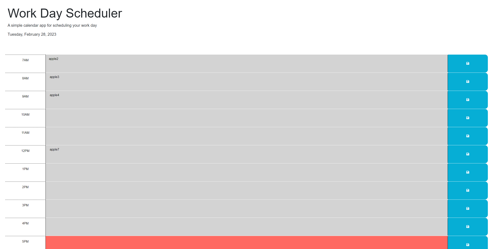
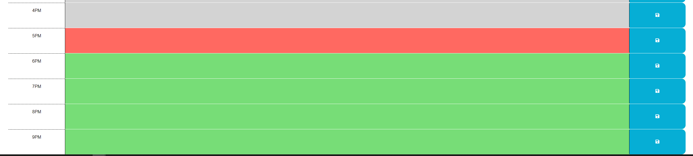

# Schedule Prepper

## Description

I had made this application with the intent to be able to store information, and that information is stored with the intent of it being used as a professional utility planer. 

# usage
the functionality of this website is that you can click on the empty space and enter in a task that would need to be done, to save this you can click on the save icon on the far side and it will save the task into loacal storage to be drawn back up whenever the page is loaded. the page will also indicate the current date as well as change the color fo the task input area from grey(past), to red(present), and green(future). here is an exapel of what the site shoudl look like at 5pm, and some of the data entries have placeholders input.

## Credits

N/A

## License

Please refer ti the LICENSE in the repo.